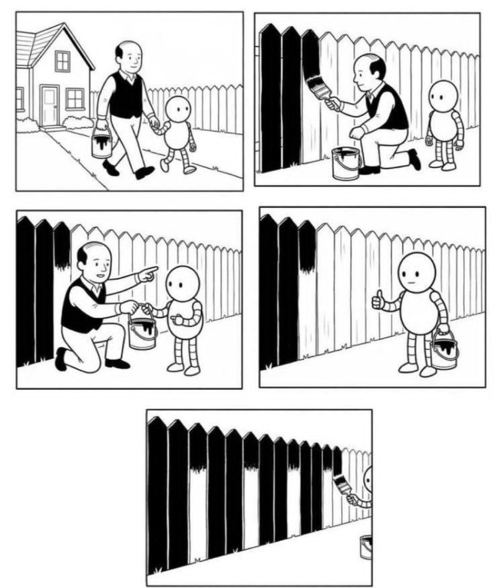

# 2190513 Data Science (ICE) @CU (2026/1)

## Syllabus:

[Syllabus](https://www.mycourseville.com/?q=courseville/course/84990/view_content_node_2101850_material)

## Code:

### Week01-02: Intro to Pandas

1. Pandas: 

2. Pandas with Youtube stat data: 

3. (Advanced) Pandas with Youtube stat data: 

4. (Extra) Python - AI Coding Assistant: 
<!--
5. ML (Template): 

6. DL (Template): 
-->
<!-- 
7. Python (Solution): 

8. ML (Solution): 

9. DL (Solution):  
-->

### Week03: Data Preparation

1. Impute Missing Value: 

2. Outliers - Take Log: 

3. Outliers - Remove them with Z-Score: .ipynb)

4. Split Train/Test: 

5. OneHotEncoder: 

### Week04-08: Traditional ML

1. Decision Trees with diabetes data: 

2. Linear Regression: 

3. Logistic Regression: 

4. Neural Network: 

5. K Nearest Neighbors (GridSearchCV): 

6. Save and Load Model: 

7. K-Means: 

8. Scikit-learn pipeline: 

### Week 09: Intro to Deep Learning

1. Image classification with CNN [`PyTorch Lightning`] (~10 min): .ipynb)

2. Image classification with Pretrained Model

    2-1. Image classification with EfficientNetV2s [`PyTorch Lightning`] (~3 min): .ipynb)

    2-2. Image classification with EfficientNetb0 (Load a Pretrained Model from Hugging Face) [`PyTorch Lightning`] with Weights & Biases (~3 min): _wandb_HuggingFace.ipynb)

3. Object detection with YOLOv8

    3-1. Object detection with YOLOv8 (basic script) [`PyTorch Lightning`] (~20-30 min): 

    3-2. Object detection with YOLOv8 (custom dataset) [`PyTorch Lightning`] (~10 min): 

4. Semantic segmentation with deeplabv3 [`PyTorch Lightning`] (~15 min): .ipynb)

5. Image classification with ViT from Hugging Face & TensorBoard [`PyTorch`] (~10 min): 

6. Time series Forecasting: Stock Price [`PyTorch`] (~10 min): 

<!--
### Week06(1): Generative AI (Prompt Engineering, Monitoring, Agentic Workflow, RAG, Fine-tuning)

1. Basic API Call with LangChain [`API`] 

2. Basic Prompt Engineering [`API`] 

3. Advanced Prompt Engineering [`API`] 

4. LangChain Playground and Tracking with LangSmith [`API`] 

5. Basic LangGraph [`API`] 

6. RAG with LangChain and Agentic RAG with LangGraph [`API`] 
-->
<!-- 
7. Creating a Simple ReAct Agent using LangGraph  -->

<!--
### Week06(2): Text Classification

1. Text Classification (TF-IDF) [`PyTorch`]: 

2. Text Classification (BERT) [`PyTorch`] Training duration ~5mins: 

3. Text Classification (Phayathaibert) [`PyTorch Lightning`] Training duration ~30mins: .ipynb)

4. Multi-label Text Classification (microsoft/deberta-v3-small) [`PyTorch`] Training duration ~10mins: 

### Week06(3): Typhoon LLM 

1. Typhoon Text Model [`API / Hugging Face`]: 

2. Typhoon OCR [`API / Hugging Face`]: 

    - Other OCR (1) : LightOn OCR [`Hugging Face`]: 

    - Other OCR (2) : Tesseract OCR: 

-->

3. Fine-tuning a Local LLM (Typhoon-7B) [`Hugging Face`]: 

